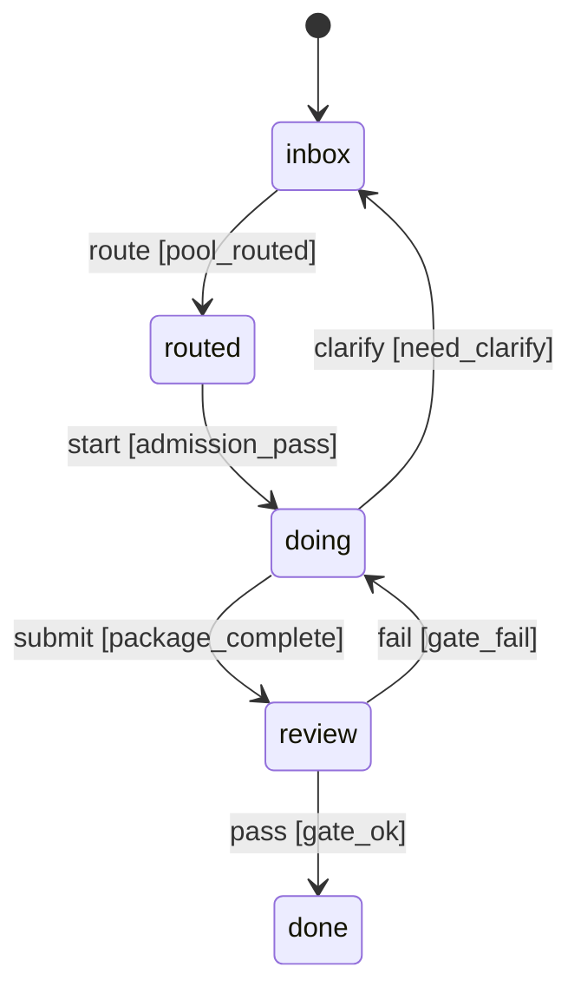

# Requirement Truth: studio (v0.1.0)

## 人话

Studio 是公司运营层的总控制台，统一管 8 个项目 + brain-loop 大脑 + adb 派工。需求从池子进，经路由、执行、全程留痕、沉淀到知识库；看板天天出分。

- 能做：portfolio 上册+健康分、需求池路由、冻结链 gate、双轨执行、五段 trace、知识沉淀、Q3 路线图、健康日报
- 不能做：跳过路由直接干、未回流即标 done、凭口头改需求、健康分与 portfolio 口径不一致
- 怎样算完：8 条 AC 每条有行为级 TC，非法流转被拒绝，trace 与 evidence 可互相回放，门禁 B/C_exec/D 紧口径通过

## User Intent

> Studio 公司运营层：统一管理 brain-loop+adb+8注册项目，需跨项目需求真相，含记忆/知识库/大脑自动化+人工介入双轨/全程trace/公司资产信息流。P0 portfolio+需求池+知识库+trace已落地，P1 REQ-002/003+state-model已补齐，full_parity新建独立产品

## Intent Coverage Matrix

| intent_id | source | strength | landing | status |
|-----------|--------|----------|---------|--------|
| INT-001 | prompt | must | AC-001 | covered |
| INT-002 | prompt | must | AC-002 | covered |
| INT-003 | prompt | must | AC-003 | covered |
| INT-004 | prompt | must | AC-004 | covered |
| INT-005 | prompt | must | AC-005 | covered |
| INT-006 | REQ-002 | must | AC-006 | covered |
| INT-007 | REQ-003 | must | AC-007 | covered |

## Acceptance Criteria

| AC ID | Description |
|-------|-------------|
| AC-001 | Portfolio 注册与健康度判定：8 项目在 portfolio.json 全量注册，health 绿(7日活动)/黄(14日无活动)/红(30日无活动；构建失败直接判红)口径与 state-model 一致，每日看板可验 |
| AC-002 | 需求池路由与状态机：requirements/pool.md 为唯一入口，状态 inbox→routed→doing→done，非法 done→inbox 与 doing未routed→doing 被拒绝，做澄清回 inbox 可验 |
| AC-003 | 跨项目需求真相冻结链：truth/tests/tasks/evidence 四件套事务闭环，B_fsm_audit 与 C_domain_exec_layer 紧口径通过，gate_ok 方可 frozen |
| AC-004 | 双轨执行与记忆：brain-loop 自动化与人工介入双轨并存，执行结果经 memory/workflow-lifecycle 与 knowledge 沉淀，跳过路由直接执行被拒绝 |
| AC-005 | 全程 trace 五段回流：每 REQ 一 TRACE-*.md 走 采集→路由→执行→回流→沉淀，未回流即标 done 被拒绝，trace 与 evidence 可互相回放 |
| AC-006 | Q3 路线图决策（REQ-002）：产出 docs/beacon/v0.1.0/execution/roadmap-q3.md，明确 quant-alpha 全量数据 与 store-front metric+10% 的优先级排序与资源分配 |
| AC-007 | 健康看板日报（REQ-003）：每日自动汇总 8 项目绿黄红，数据源 portfolio.json，结果落 trace/knowledge，阈值与 AC-001 一致 |

## FSM 五元组

| State | Event | Guard | To | Action |
|-------|-------|-------|-----|--------|
| inbox | route | pool_routed | routed | assign_project |
| routed | start | admission_pass | doing | dispatch_adb/brain-loop |
| doing | submit | package_complete | review | attach_evidence |
| review | pass | gate_ok | done | set_frozen+trace_backflow |
| review | fail | gate_fail | doing | attach_report |
| doing | clarify | need_clarify | inbox | reset_route |

终态: done

### invalid / illegal

- done --> inbox 禁止
- doing 未经 routed 禁止
- routed 未经 admission_pass 禁止
- done 未经 trace 回流禁止
- inbox 跳过 routed 直接 doing 禁止
- review 未 gate_ok 直达 done 禁止

## Domain Model

| Entity | Key | Precedence |
|--------|-----|------------|
| Requirement | REQ-ID | Portfolio — Requirement 需先在 portfolio.json 注册的项目域内 |
| Project | portfolio.json:projects.<key> | Requirement → Project — 需求路由依赖项目健康度 |
| Trace | TRACE-{REQ-ID}.md | Project, Requirement — 执行与回流依赖前两者 |
| Knowledge | knowledge/* | Trace — 沉淀依赖 trace 完成 |

## Domain FSM - Requirement

| State | From | Guard |
|-------|------|-------|
| routed | inbox | pool_routed |
| doing | routed | admission_pass |
| review | doing | package_complete |
| done | review | gate_ok |
| inbox | doing | need_clarify |

## Illegal Transition

- Requirement.done → Requirement.inbox 禁止
- Requirement.doing 未经 Requirement.routed 禁止
- Trace.done 未经 Requirement.done 禁止
- Requirement.routed 未经 admission_pass 禁止

## Non-goals

- 不新增公开一级主命令 beyond beacon 1+6
- 不接管 brain-loop/adb/beacon 成为单仓编排器，studio 仅为控制面引用路径
- 不做 UI 高保真与 8 项目各自领域实现

## Provenance

Each AC traces to a confirmed user intent (see frontmatter provenance). REQ-002/003 来自 requirements/pool.md Inbox 已确认为 must。

## Source Excerpt

```markdown
Studio 公司运营层：统一管理 brain-loop+adb+8注册项目，需跨项目需求真相，含记忆/知识库/大脑自动化+人工介入双轨/全程trace/公司资产信息流。P0 portfolio+需求池+知识库+trace已落地，P1 REQ-002/003+state-model已补齐，full_parity新建独立产品
REQ-002: Q3 跨项目路线图 — quant-alpha 全量数据 vs store-front metric+10% 优先级决策
REQ-003: 公司健康看板 — 8 项目绿/黄/红自动日报
```

## 用户旅程

| 步骤 | 角色 | 动作 | 系统反馈 | 证据 |
|------|------|------|----------|------|
| 1 | Owner | 在 requirements/pool.md 新增 REQ | pool.md inbox 可验 | `rg REQ-00 pool.md` |
| 2 | Studio | 路由到项目（inbox→routed） | portfolio 绑定可验 | `trace/TRACE-*.md` |
| 3 | 大脑/人工 | 双轨启动（doing, admission_pass） | memory/knowledge 沉淀 | `tasks.md evidence` |
| 4 | 交付 | 提交 truth/tests 完整包（review） | gate B/C 紧口径通过 | `beacon truth review` |
| 5 | 验收 | gate_ok→done，回流到 trace/knowledge | 日报/路线图可验 | `TC-011/TC-012` |

## FSM mermaid（投影）


