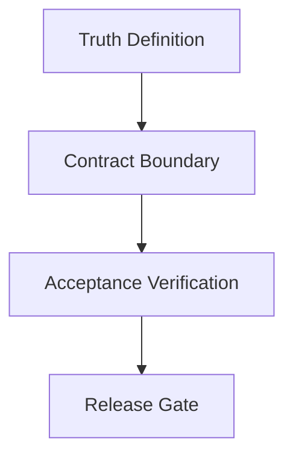

# PRD: studio

**Feature**: `studio`
**Version**: `v0.1.0`
**Status**: `draft semantic-compiled`
**Date**: `2026-09-01`
**Language**: `zh`
**Track**: `main`
**Semantic Label**: `通用需求治理`

## Overview

本 PRD 定义 `通用需求治理` 在当前版本线 `v0.1.0` 的 requirement truth，
覆盖问题定义、目标、设计原则、范围、功能需求、契约边界与验收标准。

## Outline

<!-- FILL: Mermaid diagram showing the feature's core flow or state transitions.
     Use flowchart TD/LR for procedural features, stateDiagram-v2 for stateful features. -->

## Context

- Global boundaries: `docs/beacon/global-boundaries.md`
- Version summary: `docs/beacon/v0.1.0/SUMMARY.md`
- Execution index: `docs/beacon/v0.1.0/execution/index.md`
- Existing PRDs in line: none

## Problem

### 当前断层
- 当前 `通用需求治理` 仍存在 requirement truth 与投影/执行结果之间的稳定性缺口。

### 触发信号
- 真实项目运行中出现状态噪音、证据链断点或命令语义漂移，需要在版本包内正式收敛。

### 为什么现在做
- 若不在本版本修复，后续 prototype/implement/qa/release 会继续放大漂移风险。

## Goals

### 主要目标
- 把本需求的边界、分层、恢复策略和验收链固化为可执行 contract。

### 非目标
- 不新增公开一级主命令，不改写 Beacon 既有主流程心智面。

## Design Principles

### Canonical First
- 先形成 canonical 输入，再投影到 human/machine/runtime 各面，禁止多源并写。

### Transaction First
- 写入流程遵循 prepare/validate/stage/commit/publish/verify，失败必须显式可观测。

### Truth Boundary
- 正式真相保持在 `docs/beacon/<version>/` 与 `.beacon/`，投影层仅做管理与观察。

## Scope

### In Scope
- 本 feature 的需求冻结、执行约束、验收闭环与证据写回。
- 与主线一致的 gate/review/doctor/status 判定口径。

### Out of Scope
- UI 高保真实现与非本版本产品化扩展能力。
- 与本 feature 无关的跨域重构。

## Functional Requirements

### FR-001 输入与输出 contract
- 需求输入、执行状态与交付证据必须可追溯，并可被机器校验。

### FR-002 失败语义与恢复策略
- 任一关键写入失败必须留下失败记录并阻断关键 gate，恢复路径可执行。

### FR-003 验收链路一致
- `prd -> user-story -> test-case -> implement -> qa -> release` 的映射关系持续一致。

## Source Contract

### 边界
- 人类面用于评审与决策，机器面用于校验与自动化，不允许相互反向漂移。

### 分层
- requirement layer 负责定义承诺；execution layer 负责实现；qa/release layer 负责验证与准入。

### 恢复策略
- 事务失败后优先重建 canonical 投影，再重跑 gate/review；禁止带病继续发布。

## Risks

| 风险 | 影响 | 缓解 |
|------|------|------|
| 需求语义退化为模板占位 | 高 | 增加 contract 校验与 machine 编译证据，失败时降级并记录原因 |
| 多写入点状态不一致 | 高 | 事务元数据统一并在 gate/review/release 阶段强校验 |

## Acceptance Criteria

### AC-001 主路径验收
- 关键功能按 requirement chain 全量可追溯，且存在对应测试与证据。

### AC-002 失败可恢复
- 失败事务可被显式识别并触发恢复流程，关键 gate 会阻断。

### AC-003 文档与实现一致
- PRD、User Story、Test Case 与实现证据之间无结构性漂移。

### AC-004 风险可审计
- 所有降级、fallback 与未决项都在 machine 证据中可查询。

## Non-Goals

<!-- FILL: Explicitly excluded items beyond scope. -->

## Success Metrics

- 主指标：关键 gate 阻断原因可解释且可复现。
- 辅指标：版本线 requirement closure 与执行证据一致性持续提升。

## Related PRDs

- 当前主线依赖真实项目输入与已有版本包约束。
- 并行修复项应回挂到本主线，不新增一级主命令。
- 后续扩展保持 canonical-first 与 requirement traceability。