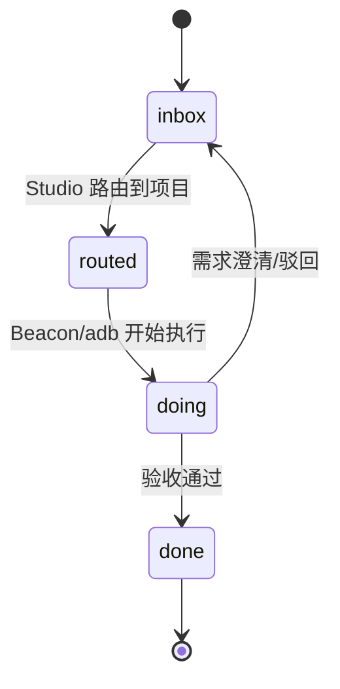
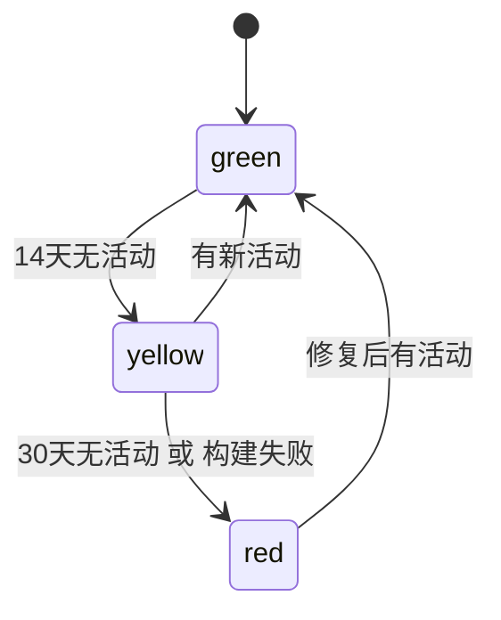

# Studio State Model v0.1.0

> 冻结公司运营层状态机，QA 据此验非法流转

## 1. 需求状态机

**非法流转（QA 必验）：** `done --> inbox` 禁止；`doing` 未经 `routed` 禁止

## 2. 项目健康度状态机

**判定口径：** 绿 7天内有 commit/交付；黄 14天无活动；红 30天或构建失败。每日看板据此自动评分。

**阈值锚点：** green 7天（最近活动）/ yellow 14天（无活动）/ red 30天（无活动或构建失败）；状态迁移 guard 判定：green <14d、yellow <30d、red ≥30d。

## 3. 公司资产信息流状态
`采集(portfolio/requirements) -> 路由(Routing) -> 执行(Beacon/adb) -> 回流(Trace) -> 沉淀(Knowledge/Memory)`
非法：跳过路由直接执行；执行结果未回流即标 done
